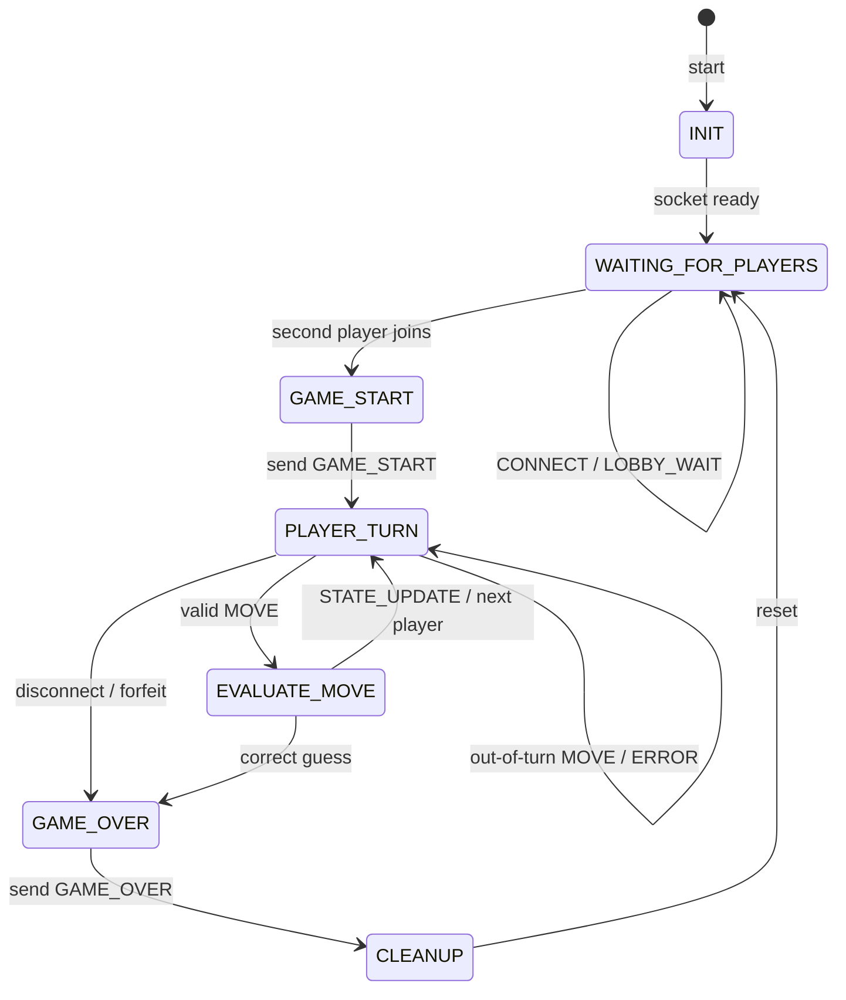
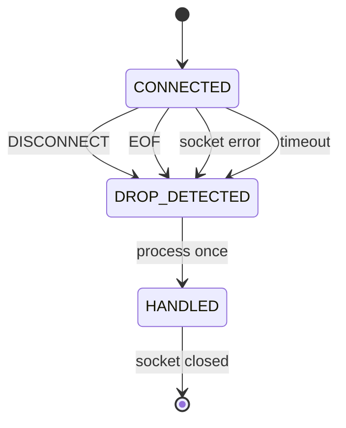

# Ward: FSM Specification

**Student:** Atlas Middleton  
**Course:** CS457  
**Date:** 10/4/2026

This document describes the server-side state machine for Ward. It uses the messages, error codes, and rules defined in `protocol_blueprint.md`.

The server is the authority for all game state. Clients only send `CONNECT`, `MOVE`, and `DISCONNECT` messages. The server validates all input, determines turn order, evaluates guesses, and broadcasts game state updates.

---

# 1. Main State Diagram

Complete transition details are described in Section 3.

---

# 2. State Descriptions

| State | Server actions |
| --- | --- |
| `INIT` | Server starts, creates listening TCP socket, initializes an empty game session. |
| `WAITING_FOR_PLAYERS` | Accepts `CONNECT` messages. The first client is `Player_1` and receives `LOBBY_WAIT`. The second client is `Player_2`. Additional clients receive `ROOM_FULL`. |
| `GAME_START` | Both players connected. Server selects hidden word, determines starting player, and sends `GAME_START` to clients. |
| `PLAYER_TURN` | Server waits for valid `MOVE` from the active player. Non-active players may not submit guesses. |
| `EVALUATE_MOVE` | Server validates guess, evaluates letter positions, generates feedback, updates active player, and checks for win-condition. |
| `GAME_OVER` | A player has guessed the hidden word correctly or an opponent has forfeited. The server sends `GAME_OVER` to clients. |
| `CLEANUP` | Server closes sockets, clears buffers, resets game data, and prepares for new match. |

---

# 3. Transition Table

| From | Trigger | Server Action | To |
| --- | --- | --- | --- |
| `INIT` | Socket initialized | Begin accepting connections | `WAITING_FOR_PLAYERS` |
| `WAITING_FOR_PLAYERS` | First valid `CONNECT` | Assign `Player_1`, send `LOBBY_WAIT` | `WAITING_FOR_PLAYERS` |
| `WAITING_FOR_PLAYERS` | Second valid `CONNECT` | Assign `Player_2` | `GAME_START` |
| `WAITING_FOR_PLAYERS` | Third client attempts connection | Send `ROOM_FULL`, reject connection | `WAITING_FOR_PLAYERS` |
| `WAITING_FOR_PLAYERS` | Waiting player disconnects | Release player slot | `WAITING_FOR_PLAYERS` |
| `GAME_START` | Hidden word selected | Send `GAME_START` | `PLAYER_TURN` |
| `PLAYER_TURN` | Valid `MOVE` from active player | Validate guess and begin evaluation | `EVALUATE_MOVE` |
| `PLAYER_TURN` | Invalid `MOVE` or incorrectly formatted message | Send `ERROR` | `PLAYER_TURN` |
| `PLAYER_TURN` | Out-of-turn `MOVE` | Send `ERROR (INVALID_TURN)` | `PLAYER_TURN` |
| `PLAYER_TURN` | Player disconnects | Award forfeit victory | `GAME_OVER` |
| `EVALUATE_MOVE` | Guess does not match hidden word | Send `STATE_UPDATE`, switch active player | `PLAYER_TURN` |
| `EVALUATE_MOVE` | Guess matches hidden word | Send final `STATE_UPDATE`, declare winner | `GAME_OVER` |
| `GAME_OVER` | Record result | Send `GAME_OVER` | `CLEANUP` |
| `CLEANUP` | Release resources | Reset game state | `WAITING_FOR_PLAYERS` |

---

# 4. Valid Moves

A `MOVE` is valid if all of the following are true:

1. The server is currently in `PLAYER_TURN`.
2. The sender is the active player.
3. The `player_id` matches the connection that submitted the message.
4. The guess length matches the configured word length.
5. The guess contains only alphabetic characters.
6. The message follows the schema defined in `protocol_blueprint.md`.

A valid guess causes the server to transition to `EVALUATE_MOVE`.

---

# 5. Invalid Moves and Bad Messages

Invalid input doesn't crash the server loop or change game state.

The server sends one `ERROR` message to the client that caused the problem and remains in the current state.

| Situation | Error Code | State After |
| --- | --- | --- |
| Invalid JSON, invalid UTF-8, unknown message type, missing fields | `INVALID_MESSAGE` | Same state |
| `player_id` does not match connection or player never joined | `INVALID_PLAYER` | Same state |
| Incorrect word length or invalid characters | `INVALID_GUESS` | Same state |
| Guess submitted by non-active player | `INVALID_TURN` | Same state |
| Message not allowed in current state | `INVALID_PHASE` | Same state |
| Third player attempts to join | `ROOM_FULL` | Same state |
| Message exceeds protocol size limits | `MESSAGE_TOO_LARGE` | Connection closed |

## Out-of-Turn Moves

An out-of-turn move occurs when:

- The non-active player submits a `MOVE`.
- A `MOVE` is sent before `GAME_START`.
- A `MOVE` is sent during `EVALUATE_MOVE`.
- A `MOVE` is sent after `GAME_OVER`.

The server replies with an `ERROR` message using `INVALID_TURN` or `INVALID_PHASE` and ignores the request.

---

# 6. Unexpected Disconnections

The server treats the following situations disconnects:

- The client sends a `DISCONNECT` message.
- `recv()` returns `b""` (EOF).
- `ConnectionResetError`.
- `BrokenPipeError`.
- `ConnectionAbortedError`.
- Socket timeout.

## Disconnect Handling by State

| Server State | Server Action |
| --- | --- |
| `WAITING_FOR_PLAYERS` | Release disconnected player's slot and continue waiting for another player. |
| `GAME_START` | Remaining player wins by forfeit. |
| `PLAYER_TURN` | Remaining player wins by forfeit and receives `GAME_OVER`. |
| `EVALUATE_MOVE` | Guess evaluation completes first. If no winner exists, the remaining player wins by forfeit upon return to gameplay. |
| `GAME_OVER` | Result already recorded. Disconnect does not change the outcome. |
| `CLEANUP` | No additional action required. |

## Both Players Disconnect

If both connections are lost before a winner is recorded, the server enters `CLEANUP` without assigning a winner.

## Send Failures

If a `BrokenPipeError` occurs while sending `GAME_OVER`, the server closes the socket and continues to `CLEANUP`.

## Handle Each Disconnect Once

The server marks a player as disconnected the first time a disconnect event occurs. A `DISCONNECT` message followed by EOF does not trigger multiple forfeits.

---

# 7. Guess Evaluation (Inside `EVALUATE_MOVE`)

1. Validate the guess format and length.
2. Compare the guess against the hidden word.
3. Assign feedback values (`GREEN`, `YELLOW`, `RED`) for each character.
4. Check whether the guess exactly matches the hidden word.
5. If the hidden word was guessed correctly, declare a winner and transition to `GAME_OVER`.
6. Otherwise send `STATE_UPDATE`.
7. Switch the active player.
8. Return to `PLAYER_TURN`.

When the game continues, the `STATE_UPDATE` message contains the guess results and identifies the next active player.

When the game ends, the server sends a final `STATE_UPDATE` followed by a `GAME_OVER` message.

---

# 8. Post-Game Reset

After `GAME_OVER`, the server enters `CLEANUP`.

During cleanup the server:

- Closes active sockets.
- Clears receive buffers.
- Removes stored game data.
- Removes stored turn information.
- Deletes the active hidden word.
- Resets player assignments.

After cleanup the server returns to `WAITING_FOR_PLAYERS`.

Players must reconnect using `CONNECT` to begin a new match.